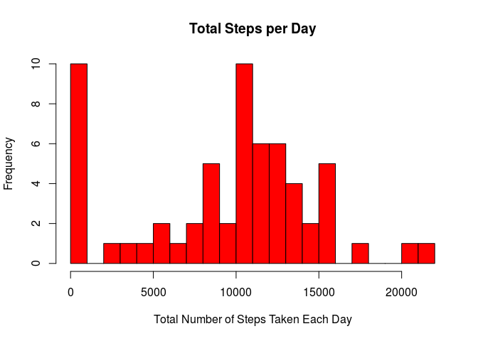
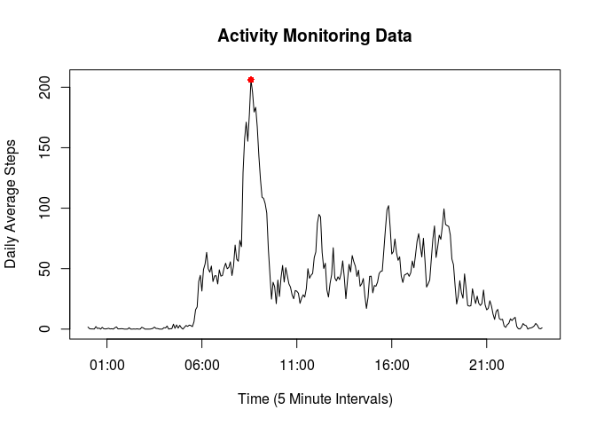
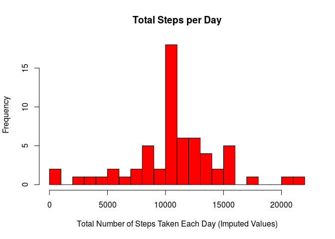
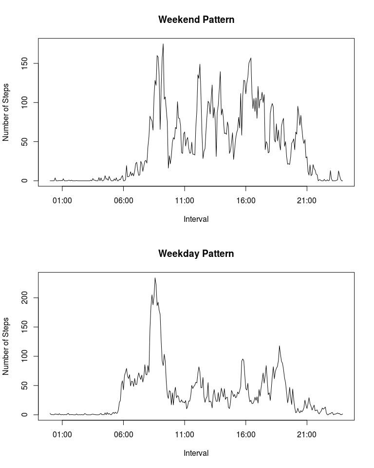

# Reproducible Research: Peer Assessment 1


## Loading and preprocessing the data
First we read in the activity data using read.csv() function.  We also change the data format for the itervals to a factor.  Finally  in order to create time series plot we need to create a time variable which represents 5 minute intervals.


```r
Activity.data <- read.csv("activity.csv")
Activity.data[3] <- factor(Activity.data[,3])
fiveMinInt <- seq(ISOdatetime(2001,1, 1, 0, 0, 0), ISOdatetime(2001,1,1,23,55,0), by=(60*5))
POSIX.Date <- strptime(Activity.data$date, "%Y-%m-%d")
```


## What is mean total number of steps taken per day?
First we will calculate the total number of steps taken per day we use the tapply() function.  Note that we are removing NA variables.


```r
Total.Steps<-tapply(Activity.data$steps, Activity.data$date, sum, na.rm=TRUE)
```

Now we can make a historgram of the toal number of steps taken each day 

```r
hist(Total.Steps, breaks=20, col="red",  xlab = "Total Number of Steps Taken Each Day", main ="Total Steps per Day")
```

 

Given the Total Number of Steps per Day we can calculate the mean and median as follows

```r
mean(Total.Steps)
```

```
## [1] 9354.23
```

```r
median(Total.Steps)
```

```
## [1] 10395
```

## What is the average daily activity pattern?
To calculate the average number of steps over a 5-minute interval taken across all days we must first split the data across the intervals using the split() function.  Then we can use sapply() in order to take the mean of the steps column.  Also note that once again we are removing NA variable.  We also create a date frame which will be used to plot the data as well as identify the time interval with the maximum number of steps which will be identified on the time series plot. 


```r
s <- split(Activity.data, Activity.data$interval)
Daily.Pattern <- sapply(s, function(x) mean(x$steps, na.rm = TRUE))
df <- data.frame(fiveMinInt, Daily.Pattern)
max.steps<- subset(df, Daily.Pattern==max(Daily.Pattern))
```
Now that we have calculated the average steps per interval over the time horizon we can now plot the time series using the base plotting system in R.  Notice that we have also identifed the 5-minute interval which contains the maximum average number of steps 

```r
plot(fiveMinInt, Daily.Pattern, type="l", ylab = "Daily Average Steps", xlab="Time (5 Minute Intervals)", main  = "Activity Monitoring Data")
points(max.steps[1], max.steps[2], col = 'red',type = 'p',pch = 16)
```

 

The red point represented the 5 minute interval 08:35 which has the average maximum number of steps per day of 206.1698113.

## Imputing missing values
To begin with we first will calculate the number of NA values found in the data set. 

```r
sum(is.na(Activity.data$steps))
```

```
## [1] 2304
```
The strategy we are going to use to fill in the missing values will be to mean for the 5 minute interval.  To begin we use the dplyr package to group the date by interval and then calculate the averages. 

```r
library(dplyr)
Int.Data <- group_by(Activity.data, interval)
Int.Avg <-summarize(Int.Data, avg = mean(steps, na.rm=TRUE))
```

Now that we have calulated the Interval Averages we can use cbind to create a new data set with the average append to the orginal data set (Activity.Data)

```r
Imputed.data<-cbind(Activity.data, Int.Avg[2])
```
Now we can use mutate to impute the missing values 

```r
Imputed.data[is.na(Imputed.data$steps),]<-mutate( Imputed.data[is.na(Imputed.data$steps),], steps=avg)
```
Given our new data set with imputed values for the missing NA values we can make a new historgram and report the mean and median

```r
Imputed.Total.Steps<-tapply(Imputed.data$steps, Imputed.data$date, sum, na.rm=FALSE)
hist(Imputed.Total.Steps, breaks=20, col="red",  xlab = "Total Number of Steps Taken Each Day (Imputed Values)", main ="Total Steps per Day")
```

 

```r
mean(Imputed.Total.Steps)
```

```
## [1] 10766.19
```

```r
median(Imputed.Total.Steps)
```

```
## [1] 10766.19
```

We can see that the mean and median values differ from estimates in the first part along the following dimensions

* Both the mean and median steps per day has increased after we have imputed the values.  This is as expected since each day that had NA values are now being replace by the 5 minute interval average.  

* The mean and median are now identical. The important part of this is not that they are identical but that they have moved closer together.  When you look at the two graphs (Missing NA vs. Imputed NA) you can see that the graph from step #1 is skewed towards zeros steps while the second graph has a much more symmetric distribution. 

* Essentially imputing the NA values in the manner we chose has made the distribution more symmetric. 
 
##Are there differences in activity patterns between weekdays and weekends
In this section we want to see if there is any difference in the activity pattern between weekdays and weekends.  In order to answer this question we must first group the data between weekday and weekends

```r
Weekday <-as.factor(ifelse( weekdays(POSIX.Date) %in% c("Saturday","Sunday"), "Weekend", "Weekday"))
Activity.data$Weekday <- Weekday
Weekday.Data <- filter(Activity.data, Weekday == "Weekday")
Weekend.Data <- filter(Activity.data, Weekday == "Weekend")

WD <- split(Weekday.Data, Weekday.Data$interval)
WE <- split(Weekend.Data, Weekend.Data$interval)

Weekday.Pattern <- sapply(WD, function(x) mean(x$steps, na.rm = TRUE))
Weekend.Pattern <- sapply(WE, function(x) mean(x$steps, na.rm = TRUE))

df.Week <- data.frame(fiveMinInt, Weekday.Pattern, Weekend.Pattern)
```
Now we can plot the acitivity data seperating weekend activity from weekday activity. 

```r
par(mfrow = c(2,1))
plot(fiveMinInt, Weekend.Pattern, type="l", ylab = "Number of Steps", xlab="Interval", main  = "Weekend Pattern")
plot(fiveMinInt, Weekday.Pattern, type="l", ylab = "Number of Steps", xlab="Interval", main  = "Weekday Pattern")
```

 


